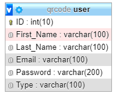
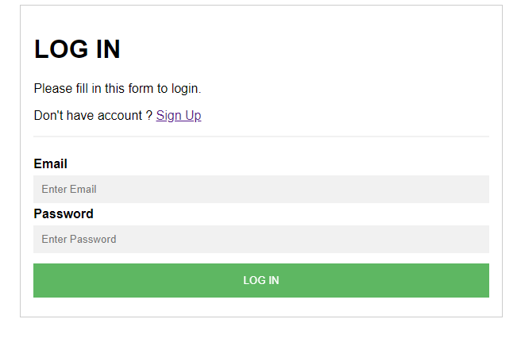
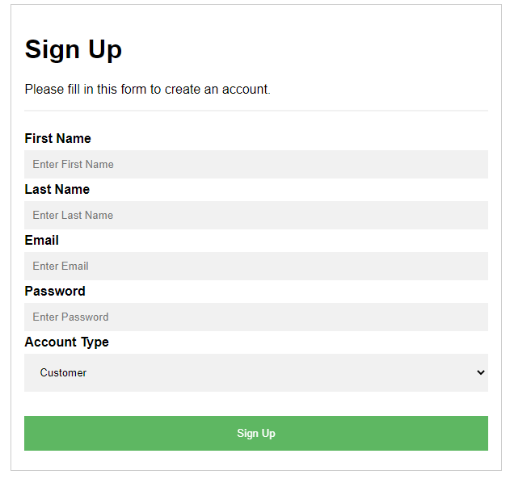
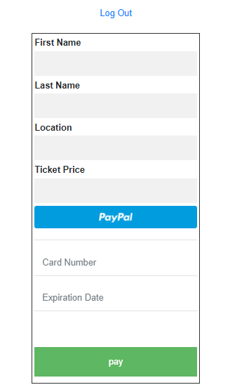
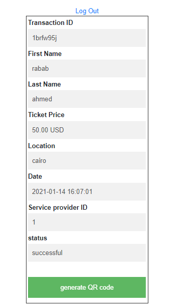
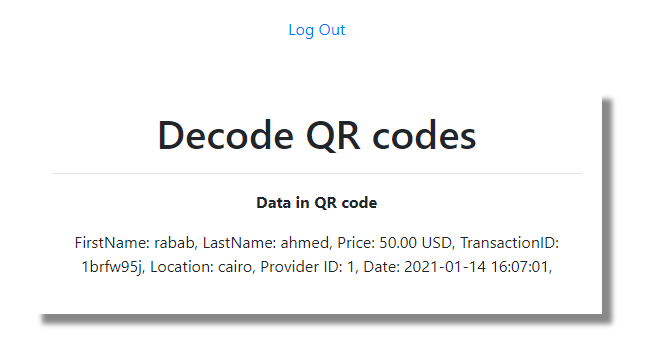

# QR Codes on Tickets System with Payment
The project is a website that can scan, identify and process a virtual ticket in a closed loop scenario by creating a virtual profile (Service Provider Account + Customer Account).
A service provider creates an account, and generates a QR Code holding ticket info (first name, last name, date, location, price, Service provider ID) and pays the ticket through an open source payment platform.
A customer creates an account, and scans the QR Code via file upload.  

# Assumptions
1. Assume that there are only two users, one customer and one provider.
2. Assume that the ticket price is generated randomly for every transaction payment.
3. Assume the payment card number is “4242424242424242” and the expired date is “12/21”.

# Database Schema
The system has MySQL DataBase called “qrcode” contains one table “user” which contains data of the user like: First Name, Last Name, Email, Password, Type (Customer, Service Provider).

# GUI Structure
1. Login Page

    This page is used to login to the website where both customer and service provider users can login to the website.
    The privileges of the user is determined depending on the type of the user so each user can access only pages he has access rights to.
    

2. Signup Page

    This page is used to create an account on the website.
    So the user must fill all the required data to sign up on the website.

3. Index Page

    A service provider uses this page to fill in the ticket info and pay the ticket price with the payment process by adding the card data.
    

4. Payment Page

    A service provider uses this page to complete the payment method and generate the qr code.

5. Scan Page

    A customer uses this page to upload the QR-Code image and scan the QR-Code to show the data in it.

6. QR Code Date Page

    A customer uses this page to show the data in a QR-Code.

# How to run?
1. Install Xampp and PHP 
2. Clone the project code
3. Go to the project root “QR-Codes-on-Tickets-System-with-Payment-master”
4. Run the following commands:
  - composer require khanamiryan/qrcode-detector-decoder
  - composer require “braintree/braintree_php”
5. Create new database called “qrcode” in PhpMyAdmin
6. Inside the database, Import “qrcode.sql” file
7. Run Xampp local host
8. Go to local host link in browser 

# Demo 
https://www.youtube.com/watch?v=EEbhU9jRmfw

# Libraries and APIs used
1. Braintree API  for payment method
2. Phpqrcode library for generating QR-Code
3. Php-qrcode-detector-decode library for scanning QR-code

# References
- http://phpqrcode 1.sourceforge.net
- https://github.com/braintree/braintree_php
- https://github.com/khanamiryan/php-qrcode-detector-decoder
- https://www.braintreepayments.com/sandbox
